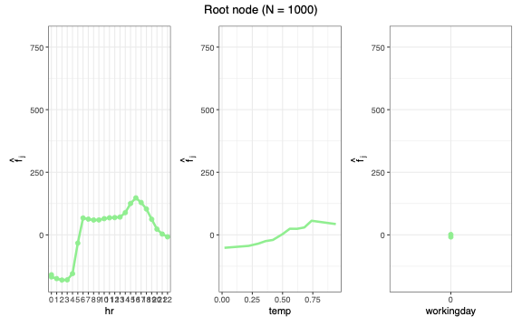
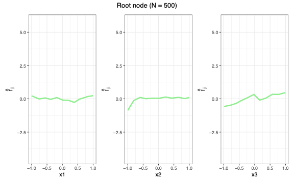
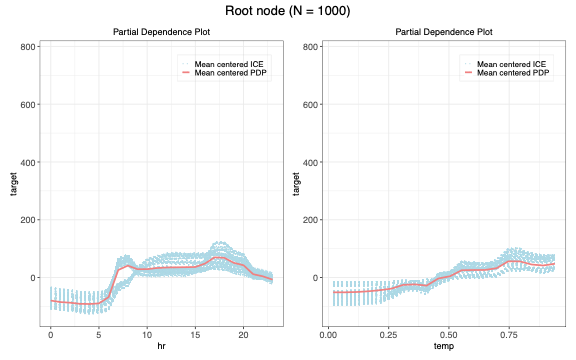
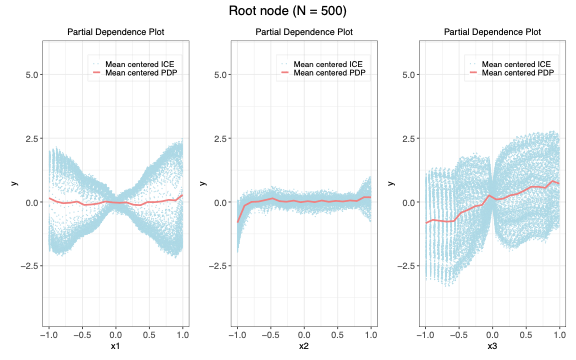

# GADGET: General Additive Decomposition based on Global Effects

<!-- badges: start -->

[](https://github.com/mlr-org/gadget/actions/workflows/R-CMD-check.yaml)

<!-- badges: end -->

The **gadget** R package implements the GADGET algorithm for interpretable machine learning. It recursively partitions the feature space to minimize the heterogeneity of feature effects (e.g., Accumulated Local Effects or Partial Dependence), producing a tree of regions where effects are more stable and easier to interpret. The package integrates with the [mlr3](https://mlr3.mlr-org.com/) ecosystem and [iml](https://cran.r-project.org/package=iml).

## Features

- **Interaction detection**: Identifies feature interactions by recursively splitting on heterogeneity of effects.
- **ALE and PD support**: `AleStrategy` for ALE (computed internally), `PdStrategy` for PD/ICE (via precomputed effects from iml or similar).
- **Visualization**: Tree structure plots and regional effect curves (ALE, PD, ICE).
- **Extensible design**: R6-based strategy pattern; plug in custom effect strategies.
- **Performance**: Core sweep and heterogeneity calculations in C++ (Rcpp/RcppArmadillo).

## Installation

Install the development version from GitHub:

```r
# install.packages("devtools")
devtools::install_github("mlr-org/gadget")
```

Requires R6, ggplot2, data.table, Rcpp; see [DESCRIPTION](DESCRIPTION) for details.

## Quick Start

Below are four complete examples for **PD** and **ALE** strategies on **Bikeshare** and **synthetic** data, each with `extract_split_info()` tables and sample plots.

### 1. ALE + Bikeshare

```r
library(gadget)
library(mlr3)
library(mlr3learners)
library(ISLR2)

data("Bikeshare", package = "ISLR2")
set.seed(123)
bike = Bikeshare[sample(seq_len(nrow(Bikeshare)), 1000), ]
bike$workingday = as.factor(bike$workingday)
bike_data = bike[, c("hr", "temp", "workingday", "bikers")]
names(bike_data)[names(bike_data) == "bikers"] = "target"

task = TaskRegr$new(id = "bike", backend = bike_data, target = "target")
learner = lrn("regr.ranger")
learner$train(task)

tree = GadgetTree$new(strategy = AleStrategy$new(), n_split = 2, impr_par = 0.01, min_node_size = 50)
tree$fit(data = bike_data, target_feature_name = "target", model = learner, n_intervals = 10)

tree$plot_tree_structure()
tree$extract_split_info()
tree$plot(data = bike_data, target_feature_name = "target", mean_center = TRUE)
```

**Sample split info:**

| id | depth | n_obs | node_type | split_feature | split_value | int_imp |
|----|-------|-------|-----------|---------------|-------------|---------|
| 1  | 1     | 1000  | root      | workingday    | 0           | 0.90    |
| 2  | 2     | 316   | left      | temp          | 0.47        | 0.02    |
| 3  | 2     | 684   | right     | temp          | 0.47        | 0.07    |
| 4–7| 3     | …     | leaf      | &lt;NA&gt;        | &lt;NA&gt;        | NA      |



### 2. ALE + Synthetic data

```r
library(gadget)
library(mlr3)
library(mlr3learners)

set.seed(1234)
n = 500
x1 = runif(n, -1, 1)
x2 = runif(n, -1, 1)
x3 = runif(n, -1, 1)
y = ifelse(x3 > 0, 3 * x1, -3 * x1) + x3 + rnorm(n, sd = 0.3)
syn_data = data.frame(x1, x2, x3, y)

task = TaskRegr$new("syn", backend = syn_data, target = "y")
learner = lrn("regr.ranger")
learner$train(task)

tree = GadgetTree$new(strategy = AleStrategy$new(), n_split = 2, min_node_size = 10)
tree$fit(model = learner, data = syn_data, target_feature_name = "y", n_intervals = 10)

tree$plot_tree_structure()
tree$extract_split_info()
tree$plot(data = syn_data, target_feature_name = "y")
```

**Sample split info:** Root splits at `x3 ≈ -0.003` (interaction: `y` depends on `x1` in opposite directions when `x3 > 0` vs `x3 ≤ 0`).

| id | depth | n_obs | split_feature | split_value  | int_imp |
|----|-------|-------|---------------|--------------|---------|
| 1  | 1     | 500   | x3            | -0.00287     | 0.85    |
| 2  | 2     | 259   | &lt;NA&gt;        | &lt;NA&gt;         | NA      |
| 3  | 2     | 241   | &lt;NA&gt;        | &lt;NA&gt;         | NA      |



### 3. PD + Bikeshare (requires iml)

For PD/ICE, compute effects with [iml](https://cran.r-project.org/package=iml) first, then pass them to `PdStrategy`:

```r
library(gadget)
library(iml)
library(mlr3)
library(mlr3learners)
library(ISLR2)

data("Bikeshare", package = "ISLR2")
set.seed(123)
bike = Bikeshare[sample(seq_len(nrow(Bikeshare)), 1000), ]
bike$workingday = as.factor(bike$workingday)
bike_data = bike[, c("hr", "temp", "workingday", "bikers")]
names(bike_data)[names(bike_data) == "bikers"] = "target"

task = TaskRegr$new(id = "bike", backend = bike_data, target = "target")
learner = lrn("regr.ranger")
learner$train(task)
predictor = iml::Predictor$new(learner, data = bike_data[, c("hr", "temp", "workingday")], y = bike_data$target)
effect = iml::FeatureEffects$new(predictor, method = "ice", grid.size = 20)

tree = GadgetTree$new(strategy = PdStrategy$new(), n_split = 2, min_node_size = 50)
tree$fit(data = bike_data, target_feature_name = "target", effect = effect)

tree$plot_tree_structure()
tree$extract_split_info()
tree$plot(effect = effect, data = bike_data, target_feature_name = "target", features = c("hr", "temp"))
```

**Sample split info:**

| id | depth | n_obs | split_feature | split_value | int_imp |
|----|-------|-------|---------------|-------------|---------|
| 1  | 1     | 1000  | workingday    | 0           | 0.36    |
| 2  | 2     | 316   | temp          | 0.45        | 0.21    |
| 3  | 2     | 684   | temp          | 0.51        | 0.33    |
| 4–7| 3     | …     | leaf          | &lt;NA&gt;       | NA       |



### 4. PD + Synthetic data

```r
library(gadget)
library(iml)
library(mlr3)
library(mlr3learners)

set.seed(1234)
n = 500
x1 = runif(n, -1, 1)
x2 = runif(n, -1, 1)
x3 = runif(n, -1, 1)
y = ifelse(x3 > 0, 3 * x1, -3 * x1) + x3 + rnorm(n, sd = 0.3)
syn_data = data.frame(x1, x2, x3, y)

task = TaskRegr$new("syn", backend = syn_data, target = "y")
learner = lrn("regr.ranger")
learner$train(task)
predictor = iml::Predictor$new(learner, data = syn_data[, c("x1", "x2", "x3")], y = syn_data$y)
effect = iml::FeatureEffects$new(predictor, method = "ice", grid.size = 20)

tree = GadgetTree$new(strategy = PdStrategy$new(), n_split = 2, min_node_size = 10)
tree$fit(data = syn_data, target_feature_name = "y", effect = effect)

tree$plot_tree_structure()
tree$extract_split_info()
tree$plot(effect = effect, data = syn_data, target_feature_name = "y", mean_center = TRUE)
```

**Sample split info:**

| id | depth | n_obs | split_feature | split_value | int_imp |
|----|-------|-------|---------------|-------------|---------|
| 1  | 1     | 500   | x3            | -0.00287    | 0.95    |
| 2  | 2     | 259   | &lt;NA&gt;        | &lt;NA&gt;        | NA      |
| 3  | 2     | 241   | &lt;NA&gt;        | &lt;NA&gt;        | NA      |



## API overview

| Component    | Description                                                                 |
|-------------|-----------------------------------------------------------------------------|
| `GadgetTree`| Main entry: `$new()`, `$fit()`, `$plot()`, `$plot_tree_structure()`, `$extract_split_info()` |
| `AleStrategy` | ALE-based trees; pass `model` to `$fit()`. ALE computed internally.      |
| `PdStrategy`  | PD/ICE trees; pass `effect` (e.g. from `iml::FeatureEffects`) to `$fit()`. |

**Fit arguments**

- **AleStrategy**: `model` (required), `n_intervals = 10`, `predict_fun = NULL`, `order_method = "raw"`, `with_stab = FALSE`
- **PdStrategy**: `effect` (required)
- **Both**: `feature_set`, `split_feature` (optional); tree params: `impr_par`, `min_node_size`, `n_quantiles`

## Methodology

GADGET recursively partitions the feature space. At each node it:

1. Computes effect heterogeneity (e.g., variance of ALE derivatives or PD/ICE curves).
2. Searches for a split (on a chosen feature) that maximally reduces heterogeneity.
3. Splits if the reduction exceeds a threshold (`impr_par`) and node size is sufficient.

Splits isolate regions where feature effects are more stable, revealing interaction structure.

## Advanced usage

### Feature subsets

Restrict which features are used for effects and splitting:

```r
tree$fit(
  data = data,
  target_feature_name = "y",
  model = learner,
  feature_set = c("x1", "x2"),
  split_feature = c("x3")
)
```

### Plot options

- `depth`, `node_id`, `features`: Filter which depths, nodes, or features to plot.
- `show_point`: Overlay observed (x, y) points.
- `mean_center`: Mean-center effect curves.

## Documentation

- In R: `?gadget`, `?GadgetTree`, `?AleStrategy`, `?PdStrategy`
- Paper draft: [`paper/`](paper/) (see `paper/README.md`)

## Citation

Herbinger, J., Wright, M. N., Nagler, T., Bischl, B., and Casalicchio, G. (2024). Decomposing Global Feature Effects Based on Feature Interactions. *Journal of Machine Learning Research*, 25(23-0699), 1–65. <https://jmlr.org/papers/volume25/23-0699/23-0699.pdf>

## License

MIT
