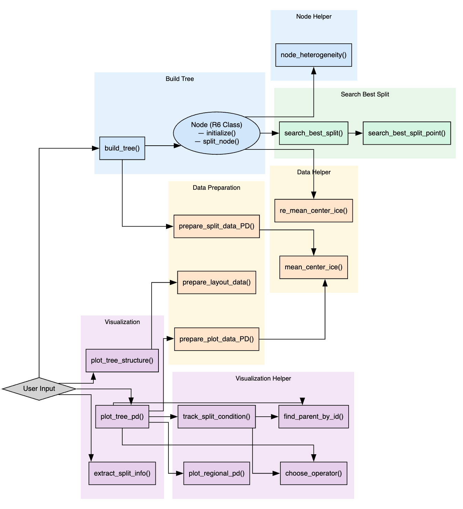

```{r setup, include=FALSE}
knitr::opts_chunk$set(echo = TRUE, warning = FALSE)
```

```{r}
library(ISLR2)
library(mlr)
library(mlr3)
library(mlr3learners)
library(mlr3verse)
library(mlr3tuning)
library(iml)
```

## Overview of the GADGET Package

This document demonstrates the use of the **GADGET** package to build interpretable trees based on local feature effects. We showcase both synthetic XOR data and a real-world Bikeshare dataset.

The **GADGET** (Generalized Additive Decomposition for Global Explanation Trees) package provides interpretable model explanation through regionally partitioned trees, built upon local feature effect estimates. In this notebook, we demonstrate how GADGET can be used to construct and visualize global explanations from local interpretation methods such as **ICE** (Individual Conditional Expectation) or **PDP** (Partial Dependence Plots).

The following core functions are provided to users:

-   `compute_tree()`\
    Constructs a recursive explanation tree by optimizing an objective function (e.g., ICE-based or PDP-based L2 reduction) at each node. It supports both numeric and categorical features and allows flexible control over split granularity and minimal node sizes.

-   `extract_split_criteria()` Summarizes the full structure of the computed explanation tree, including split features, values, node depth, and objective improvement. It can also extract criteria related to a specific feature.

-   `plot_tree()` Visualizes the ICE or PDP behavior of each feature in the tree across split regions. Regional plots help users interpret how a model behaves differently across subgroups.

-   `plot_tree_structure()` Draws the structure of the explanation tree itself, with node annotations and split conditions.

This notebook walks through two examples:

1.  A **synthetic XOR-like dataset** to illustrate behavior in controlled settings with known interactions.

2.  The **Bikeshare dataset** from the ISLR2 package, demonstrating usage on real-world, heterogeneous data.

The GADGET package is especially useful when interpreting black-box models (e.g., neural networks, random forests) in terms of their localized behavior across feature space.

## Synthetic data

### Data generation

The synthetic data set is constructed to mimic an XOR-like interaction structure with noise. The response variable y is defined as:

$$
y = 
\begin{cases}
+3x_1, & \text{if } x_3 > 0 \\\\
-3x_1, & \text{if } x_3 \leq 0
\end{cases}
+ x_3 + \varepsilon
$$

where $\varepsilon \sim \mathcal{N}(0, 0.3^2)$, and all covariates $x_1, x_2, x_3 \sim \mathcal{U}(-1, 1)$ independently.

This setup creates a nonlinear response surface with sharp localized directional changes depending on the signs of $x_3$ and $x_4$, making it suitable for evaluating interpretable model partitioning via ICE/PDP.

```{r, echo=FALSE, results='hide'}
n = 500
set.seed(123)
create_xor = function(n, seed){
  x2 = runif(n, -1, 1)
  x3 = runif(n, -1, 1)
  x1 = runif(n, -1, 1)
  y = ifelse(x3>0, 3*x1, -3*x1) + x3 + rnorm(n, sd = 0.3)
  data.frame(x1, x2, x3, y)
}
syn.data = create_xor(n, seed)
syn.X = syn.data[, setdiff(names(syn.data), "y")]
syn.features = colnames(syn.X)
set.seed(123)
syn.task = makeRegrTask(data = syn.data, target = "y")
ps = makeParamSet(
  makeDiscreteParam("decay", values = c(0.5, 0.1, 1e-2, 1e-3, 1e-4, 1e-5)),
  makeDiscreteParam("size", values = c(3, 5, 10, 20, 30))
)
ctrl = makeTuneControlGrid()
rdesc = makeResampleDesc("CV", iters = 5L)
res = tuneParams(makeLearner("regr.nnet", maxit = 1000), task = syn.task, resampling = rdesc,
  par.set = ps, control = ctrl, measures = list(mlr::mse, mlr::mae, mlr::rsq))
set.seed(123)
syn.lrn = makeLearner("regr.nnet", maxit = 1000, size = res$x$size, decay = res$x$decay, trace = F)
syn.model = mlr::train(task = syn.task, learner = syn.lrn)
syn.predictor = Predictor$new(syn.model, data = syn.data[which(names(syn.data) != "y")], y = syn.data$y)
syn.effect = FeatureEffects$new(syn.predictor, grid.size = 20, method = "ice")
```

### Feature effects and tree building

We first use the `iml` package to compute **Individual Conditional Expectation (ICE)** curves for each feature based on the trained neural network model. These ICE curves capture local prediction behavior.

Next, we apply `compute_tree()` from the GADGET package to build an interpretable explanation tree. The tree partitions the data into regions where the PDP (partial dependence) behavior is relatively homogeneous, as measured by the objective function `"SS_L2_pd"`.

The set `Z` specifies contextual features that may influence the behavior of the features of interest. The resulting tree identifies regions with distinct interaction patterns in model predictions.

```{r}
library(GADGET)
syn.tree = build_tree(effect = syn.effect, 
                      data = syn.data, 
                      effect.method = "pd",
                      target.feature.name = "y",
                      split.feature = NULL,
                      n.split = 2, 
                      impr.par = 0.1,
                      n.quantiles = NULL, 
                      min.node.size = 1)
syn.plot = plot_tree_pd(syn.tree, syn.effect, syn.data, 
                        target.feature.name = "y",
                        show.plot = T, show.point = T, mean.center = T)
plot_2_1 = plot_node_pd(syn.plot, depth = 2, node.idx = 1)
plot_tree_structure(syn.tree)
extract_split_info(syn.tree)
```

## Bikeshare data

### Data processing

We load the **Bikeshare** dataset from the ISLR2 package, which contains hourly bike rental counts along with weather and calendar-related features.

The feature set includes numeric (e.g., `temp`, `windspeed`) and categorical variables (e.g., `season`, `workingday`). The response variable is `bikers`, representing the number of rented bikes.

To ensure model robustness, we remove the single observation with `"heavy rain/snow"` in the `weathersit` variable, as it could distort model fitting due to its rarity.

```{r}
data(Bikeshare)
bike = data.table(Bikeshare)
bike[, hr := as.numeric(as.character(hr))]
bike[, workingday := as.factor((workingday))]
bike[, season := as.factor(season)]

# feature space
bike.X = bike[, .(day, hr, temp, windspeed, workingday, hum, season, weathersit, atemp, casual)]

# target
bike.y = bike$bikers

# analyzed dataset
train1 = cbind(bike.X, "cnt" = bike.y)
# remove data point with weathersit = heavy rain/snow (only one occurence) to use lm within benchmark
bike.data = as.data.frame(train1)[-which(train1$weathersit == "heavy rain/snow"), ]
bike.data$weathersit = droplevels(bike.data$weathersit)

set.seed(123)
Bike.task = TaskRegr$new(id = "bike", backend = bike.data, target = "cnt")
Bike.learner = lrn("regr.ranger")
Bike.learner$train(Bike.task)

bike.X = Bike.task$data(cols = Bike.task$feature_names)
bike.y = Bike.task$data(cols = Bike.task$target_names)[[1]]

Bike.predictor = Predictor$new(model = Bike.learner, data = bike.X[1:3500,], y = bike.y[1:3500])
```

### Feature effects and tree building

```{r}
effect_bike_single = FeatureEffect$new(Bike.predictor, method = "ice",
  feature = "hr",
  grid.size = 20)

bike_tree = build_tree(effect_bike_single, bike.data[1:3500,], 
                       effect.method = "pd",
                       split.feature = c("workingday", "temp"),
                       target.feature.name = "cnt", 
                       n.split = 2,
                       impr.par = 0.1,
                       min.node.size = 50,
                       n.quantiles = NULL)

plot = plot_tree_pd(bike_tree, effect_bike_single, bike.data[1:3500,], 
                    target.feature.name = "cnt",
                    show.plot = T, show.point = T, mean.center = T)
plot_2_1 = plot_node_pd(plot, depth = 2, node.idx = 1)
plot_tree_structure(bike_tree)
extract_split_info(bike_tree)
```

## TODO

We outline several planned improvements and extensions to the GADGET package along two main directions:

### 🔧 Computational Efficiency

-   **Objective optimization speed-up**: Consider integrating ideas from the **FAST** algorithm to accelerate computation of regional loss (e.g., L2 loss on ICE/PDP/ALE curves).
-   **Efficient SHAP value estimation**: Explore fast Shapley value approximation methods (provided by Julia).

### 🖼️ Visual Presentation & Interactivity

-   **Interactive tree plots**: Investigate combining `shiny` with `ggparty` to allow users to interactively explore split trees and node-level plots.
    -   This will reduce clutter.
    -   Users can expand/collapse nodes and selectively view ICE/PDP behavior.

### 📌 Additional Work

-   Complete and validate **ALE** and **SHAP**-based functions within the GADGET framework.
-   Extend **unit tests** beyond tree splitting:
    -   ✅ Already implemented: unit tests for tree splitting helper functions (e.g., `find_best_binary_split`, `perform_split`, `generate_split_candidates`).
    -   ⏳ Planned: test coverage for the main tree construction workflow (`compute_tree()`), visualization functions (`plot_tree()`, `plot_tree_structure()`), and general helpers (`extract_split_criteria()`).
-   Add more usage examples and inline documentation to enhance package usability.

These enhancements will further improve the interpretability, usability, and scalability of the GADGET package for both academic and applied use cases.

### GADGET Architecture Diagram

The following figure shows the structure and flow of core functions and objects in the GADGET package.

```{r, echo=FALSE, out.width="100%", fig.align='center'}

